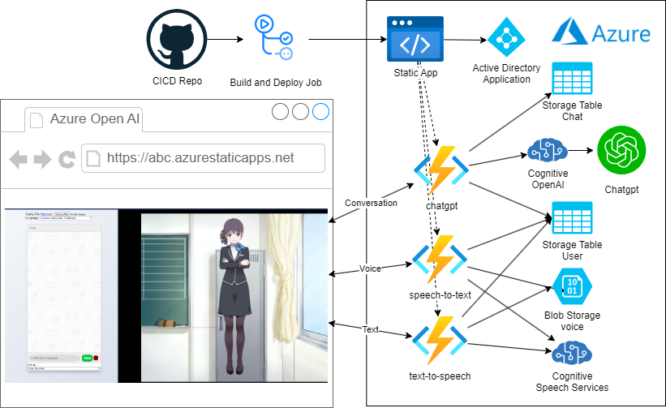

# Azure OpenAI Live2D Virtual Assistant

This is a sample implementation of an application that displays models output by Live2D Cubism 4 Editor from Cubism Web Samples with Azure OpenAI and Azure Text to Speech.

It is used in conjunction with the Cubism Web Framework and Live2D Cubism Core.



## Directory structure
```
.
├─ .vscode          # Project settings directory for Visual Studio Code
├─ Core             # Directory containing Live2D Cubism Core
├─ Framework        # Directory containing source code such as rendering and animation functions
├─ website          # Directory containing source code for the web
├─ cdktf            # Directory containing source code for Azure deployment.
```

## Live2D Cubism Core for Web

A library for loading the model.

This repository does not manage Cubism Core.
Download the Cubism SDK for Web from [here](https://www.live2d.com/download/cubism-sdk/download-web/) and copy the files in the Core directory.


## Development environment construction

1. Create a new CodeSpace.
2. Install [Node.js] and [Visual Studio Code]
3. Open **the top directory of this SDK** in Visual Studio Code and install the recommended extensions
    * In addition to pop-up notifications, you can check the others by typing `@recommended` from the Extensions tab
4. You need to go to Live2D website to get your free license packages.
5. Copy the file to Framework.

### Operation check of sample demo

Enter `>Tasks: Run Task` in the command palette (*View > Command Palette...*) to display the task list.

1. Select `npm: install - Samples/TypeScript/Demo` from the task list to download the dependent packages
1. Select `npm: build - Samples/TypeScript/Demo` from the task list to build the sample demo
1. Select `npm: serve - Samples/TypeScript/Demo` from the task list to start the simple server for operation check
1. Enter `http://localhost:5000/website/` in the URL field of your browser to access it
1. Enter `>Tasks: Terminate Task` from the command palette and select `npm: serve` to terminate the simple server

For other tasks, see [README.md](Samples/TypeScript/README.md) of the sample project.

NOTE: Settings for debugging are described in `.vscode/tasks.json`.

## Development environment

### Node.js

* 18.8.0
* 16.17.0
* 14.20.0
